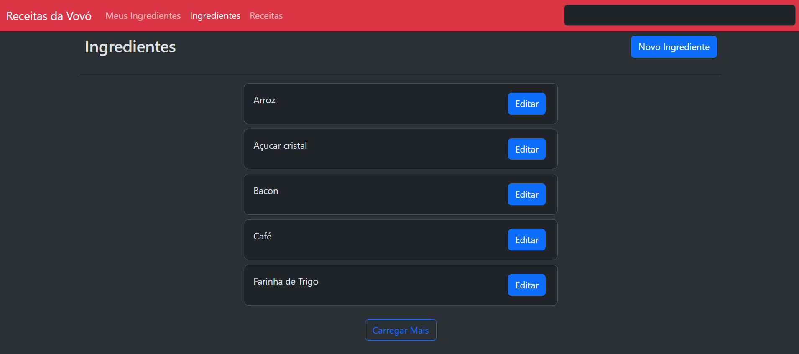
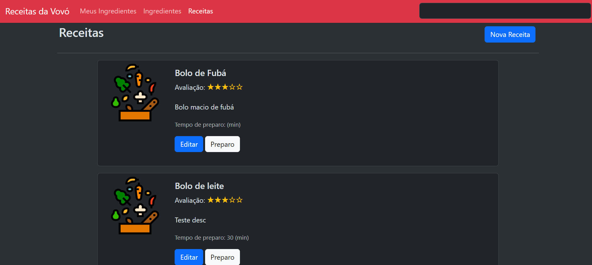
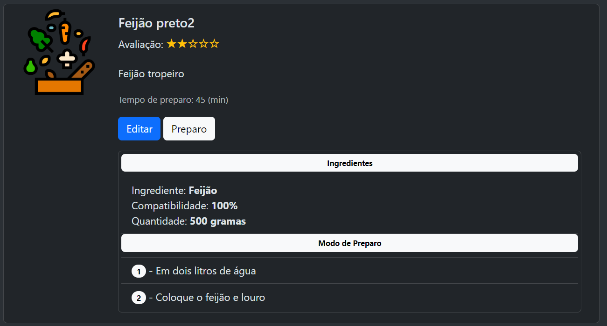

# MyRecipes App

 

## Descrição

**MyRecipes App** é uma aplicação web desenvolvida para gerenciar receitas e ingredientes. Com esta aplicação, você pode criar, editar e listar receitas e ingredientes, bem como visualizar receitas que correspondem aos ingredientes fornecidos.

## Tecnologias Utilizadas

- **Frontend**: Angular

## Funcionalidades

- **Gerenciamento de Ingredientes**
  - Adicionar novos ingredientes
  - Editar ingredientes existentes
  - Listar todos os ingredientes

- **Gerenciamento de Receitas**
  - Adicionar novas receitas
  - Editar receitas existentes
  - Listar todas as receitas

- **Compatibilidade de Ingredientes**
  - Listar receitas que incluem ou quase incluem os ingredientes fornecidos

## Instalação

### Requisitos

- [Angular CLI](https://angular.io/cli)

### Clonar o Repositório

```bash
git clone https://github.com/ricardochomicz/myrecipes-app.git
cd myrecipes-app
```

### Instalar dependências

```bash
npm install
```

### Carregar imagem docker (local)
```bash
docker load -i recipes-app.tar
```

### Rodar container na porta 8080
```bash
docker run -d -p 8080:80 recipes-app
```

### Link imagem
https://drive.google.com/file/d/1O3SbmkHDGsnosdc2zFf_wEvKxoA9p8VW/view?usp=sharing



